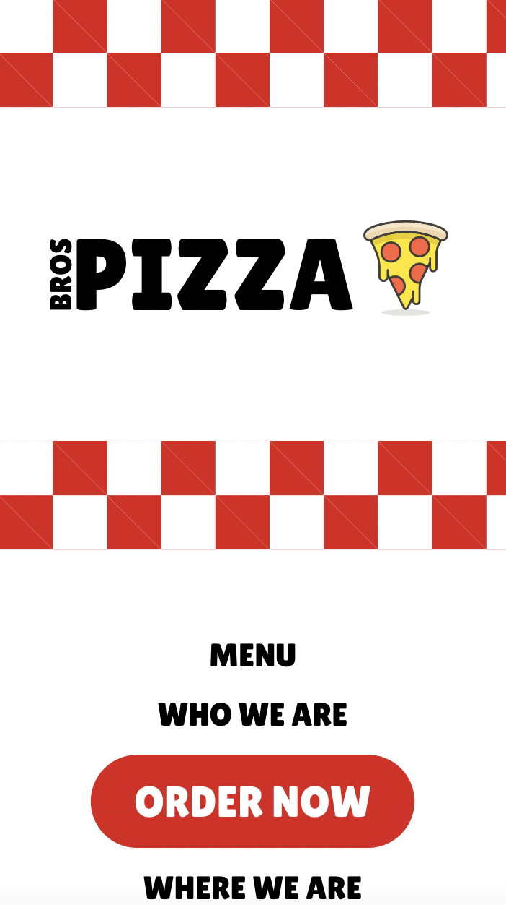
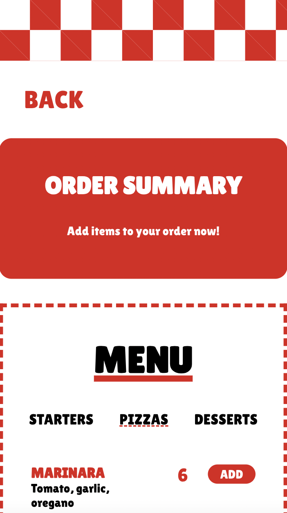
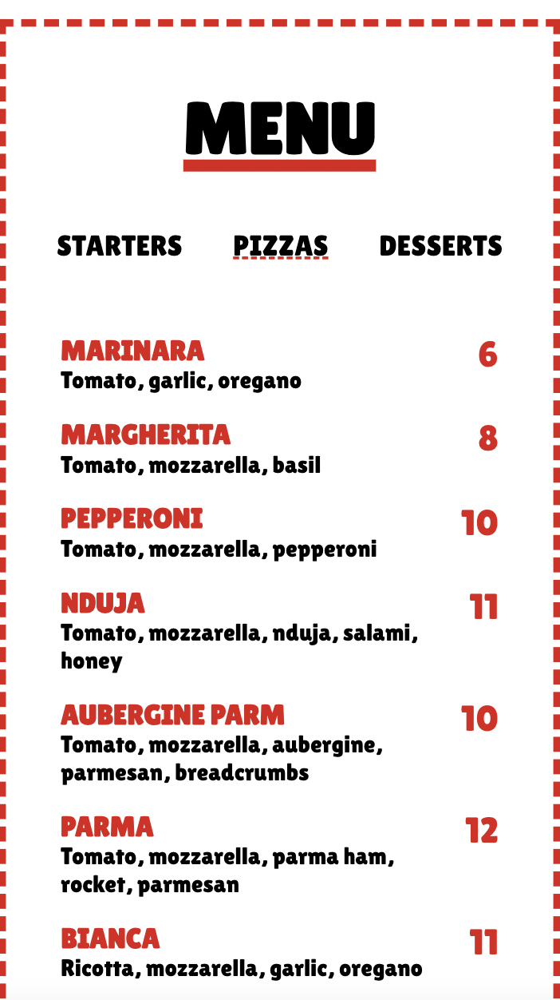
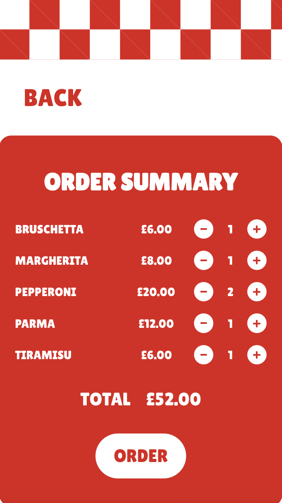
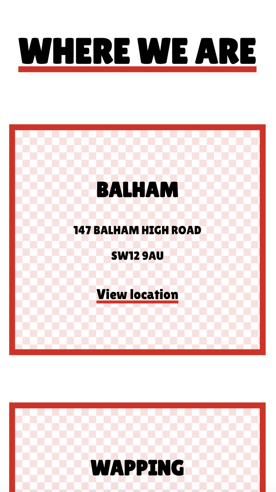
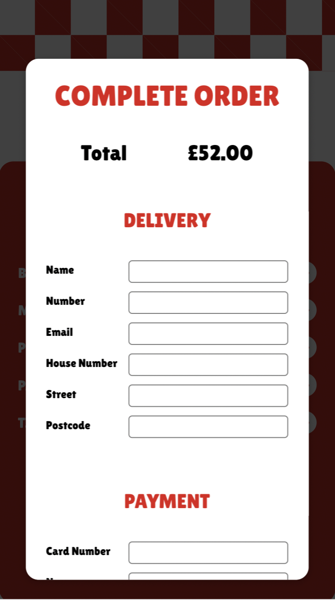
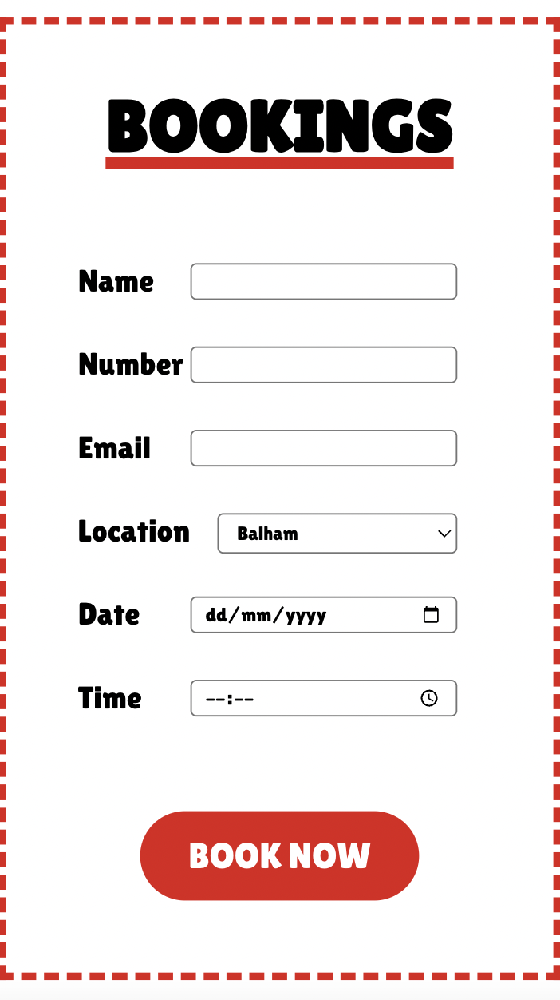
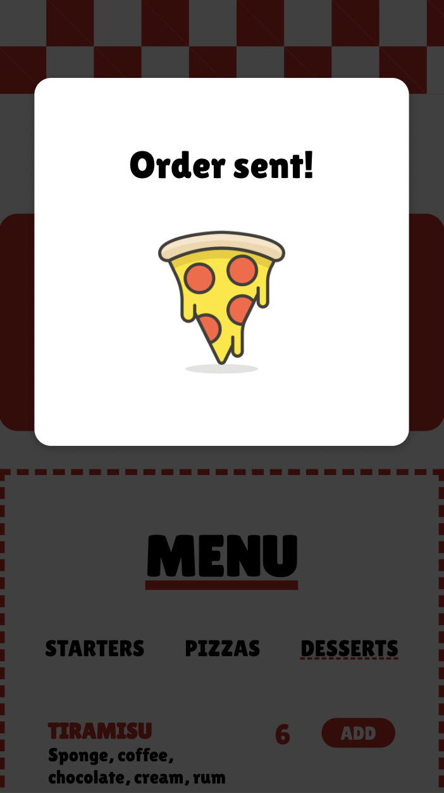

# BROS PIZZA

React site for pizza restaurant featuring ability to view menu, make bookings and make orders.

Uses hooks, state, context and React Router amongst other React fundamentals. 

:round_pushpin: [wwww.bros-pizza.com](https://resonant-rabanadas-85a557.netlify.app/)

<section>

</section>

 
 

<section align=center>
&nbsp;&nbsp;&nbsp;&nbsp;&nbsp;&nbsp;
 
&nbsp;&nbsp;&nbsp;&nbsp;&nbsp;&nbsp;
 
&nbsp;&nbsp;&nbsp;&nbsp;&nbsp;&nbsp;
 
&nbsp;&nbsp;&nbsp;&nbsp;&nbsp;&nbsp;

</section>
